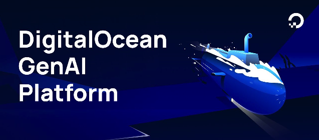

# DigitalOcean GenAI Platform Workshop

Welcome to the **DigitalOcean GenAI Platform Workshop** repository! This repo contains all the materials you'll need to explore and build AI-powered applications using DigitalOcean's GenAI Platform. From hands-on examples to reference guides, you'll find everything to kickstart your journey into creating and deploying AI agents with ease.

## Workshop Outline

In this workshop, you'll learn how to:
- Build Retrieval-Augmented Generation (RAG) agents using DigitalOcean's GenAI tools.
- Create an AI-powered Recruiter Assistant to help with hiring processes.
- Set up guardrails to ensure ethical and compliant recruitment practices.

## Get Started

If you don't have a DigitalOcean account yet, you can sign up for one [here](./SETUP.md).

Otherwise, to start on the workshop, click [here](./RECRUITER_AGENT.md) to begin the course.

## Resources

You can find the presentation slides [here](https://docs.google.com/presentation/d/1kMBcdQPIhF-PpyDUsqLcenLGbvqOi0FsSNXYtnZqtb4/edit?usp=sharing). Explore these additional resources to enhance your understanding of the GenAI Platform:

Official Documentation:

- [GenAI Quick Start Guide](https://docs.digitalocean.com/products/genai-platform/getting-started/quickstart/)
- [Managing AI Agents](https://docs.digitalocean.com/products/genai-platform/how-to/manage-ai-agent/)

Data Deep Dive:

- [The Secret Sauce to a Winning Dataset for GenAI - Quality Over Quantity](https://www.digitalocean.com/community/conceptual-articles/the-secret-sauce-to-a-winning-dataset-for-genai-quality-over-quantity)
- [Effective Strategies for Preparing and Sending Data to GenAI Agents](https://www.digitalocean.com/community/conceptual-articles/send-data-to-genai-agents)

Features Deep Dive:

- [From Knowledge Gaps to Expert Agents - Unlocking the Advanced Use Cases of RAG with the GenAI Platform](https://www.digitalocean.com/community/conceptual-articles/from-knowledge-gaps-to-expert-agents-unlocking-the-advanced-use-cases-of-rag-with-the-genai-platform)
- [Integrating GenAI in Your Web App](https://www.digitalocean.com/community/tutorials/how-to-integrate-digitalocean-genai-platform-in-your-web-app-using-digitalocean-cloud-functions)

General:

- [Introducing the GenAI Platform: Simplifying AI Development for All](https://www.digitalocean.com/blog/introducing-generative-ai-platform)

## Need Help?

You can reach out to...

### Author Socials

You can reach out to the author/presenter, aka [David vonThenen](https://linktr.ee/davidvonthenen), for this workshop via:

- [LinkedIn @narasimhabadrinath](https://www.linkedin.com/in/narasimha-badrinath/)
- [GitHub @narasimhabadrinath](https://github.com/bnarasimha)
- [Twitter @narasimhabadrinath](https://x.com/bnarasimha21)

### DigitalOcean Contact

The DigitalOcean community is here for you! Find assistance through these links:

- [DigitalOcean Community Tutorials](https://www.digitalocean.com/community/tutorials)
- [DigitalOcean Discord](https://discord.com/invite/digitalocean)
- [DigitalOcean Documentation](https://docs.digitalocean.com/)

## Feedback

Have ideas for improvement or something to share? Submit an issue or contribute to the repo! Happy coding!
