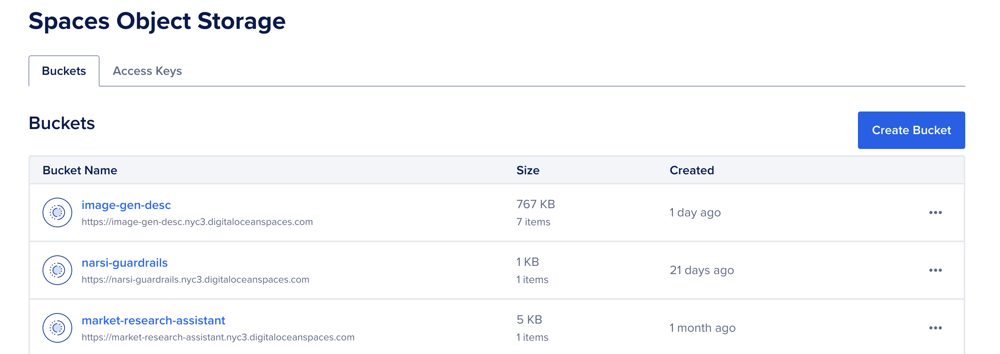
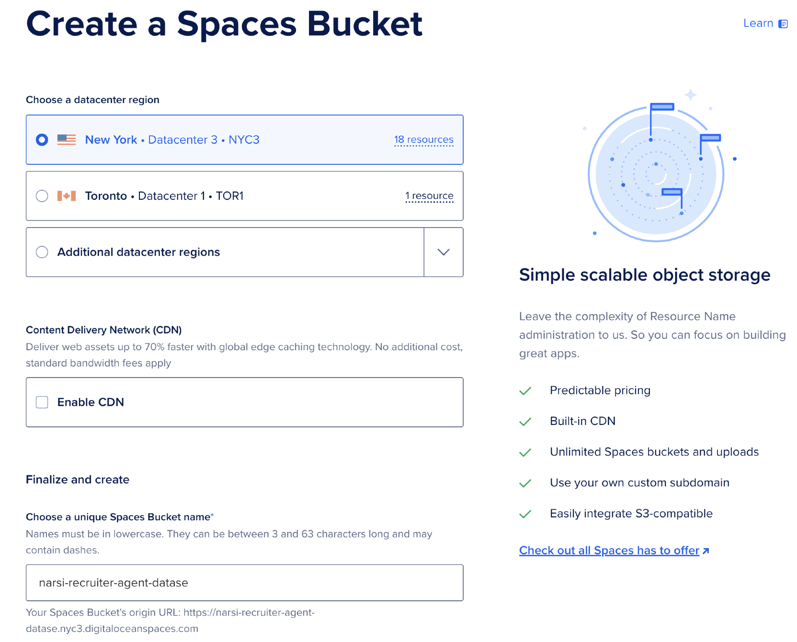
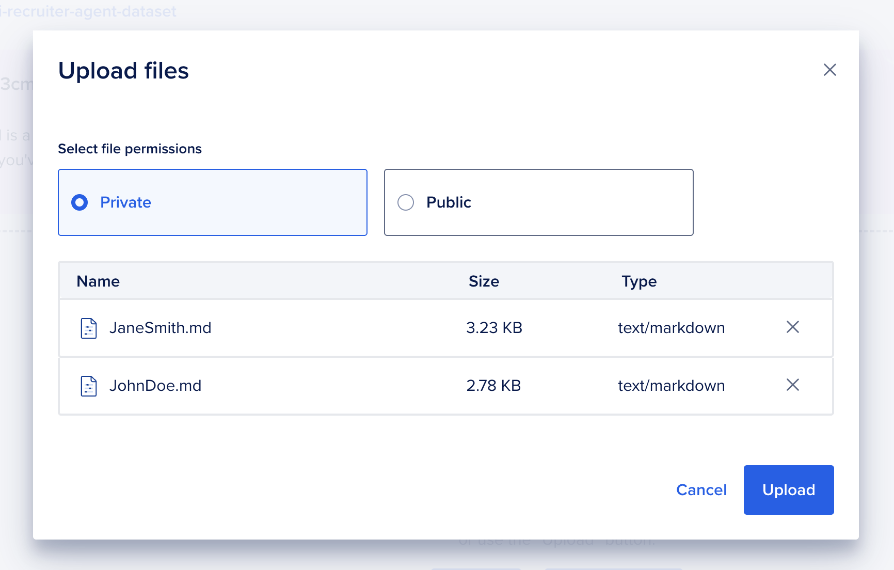

# Step 1: Creating Your Dataset on DigitalOcean Spaces

This guide will walk you through creating a DigitalOcean Spaces object store to host the dataset for the Recruiter AI Agent, extracting the dataset contents, and uploading the prepared data.

## 1.1 Create a Spaces Object Store

To begin, you'll need to create a DigitalOcean Spaces object store where the dataset will be stored. Follow these steps:

1. Log in to your DigitalOcean account.
2. Navigate to the [Spaces creation page](https://cloud.digitalocean.com/spaces).

   

3. Click **Create Bucket** and configure the following:
   - Select a datacenter region closest to your target audience.
   - Choose a unique name for your Space (e.g., `<your name>-recruiter-agent-dataset`).
     - **NOTE:** Spaces buckets have unique names since they can be exposed the public internet if desired. Include your name to make the bucket name unique.
   - Leave the default settings for permissions unless you require public access.

   

4. Once the Space is created, note the endpoint URL for later use.

For more details, refer to the [Spaces Quickstart Guide](https://docs.digitalocean.com/products/spaces/getting-started/quickstart/).

## 1.2 Extract the Dataset Contents

The dataset for the Recruiter AI Agent is available in the GitHub repository. Extract the contents of the dataset archive as follows:

1. If you haven't done this already, clone the workshop repository:

   ```bash
   git clone https://github.com/do-community/genai-agent-workshop-compact-edition.git
   ```

2. Navigate to the dataset folder:

   ```bash
   cd genai-agent-workshop/recruiter-walkthrough
   ```

3. Extract the contents of the ZIP file:

   ```bash
   unzip recruiter-agent.zip -d recruiter-agent-dataset
   ```

## 1.3 Upload the Dataset to the Spaces Object Store

We need to upload the dataset to the spaces bucket. 



Drag and drop the following files in `recruiter-agent-dataset` folder to your spaces bucket.

Your dataset is now ready to be accessed by the Recruiter AI Agent! Verify the files have been uploaded and then move onto the next section.

## Next Steps...

→ [Next Up: Creating Your Knowledge base on DigitalOcean Spaces](./STEP2_KNOWLEDGE_BASE.md) 
