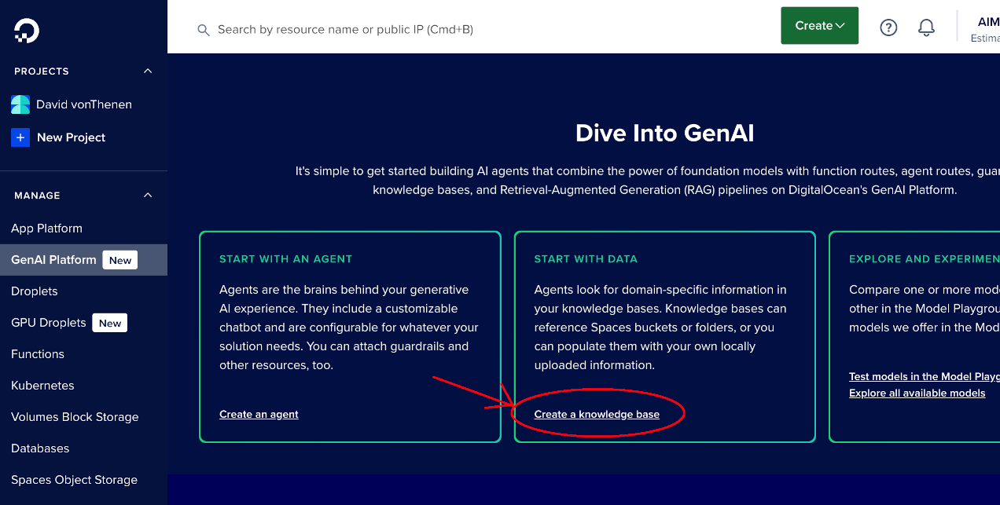
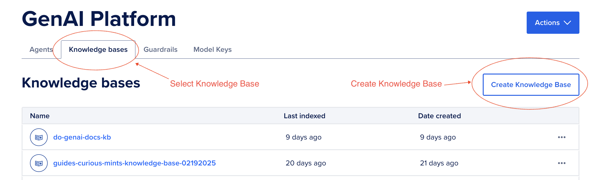
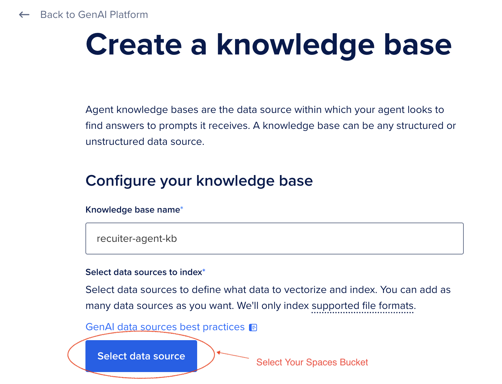
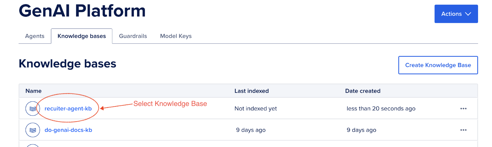
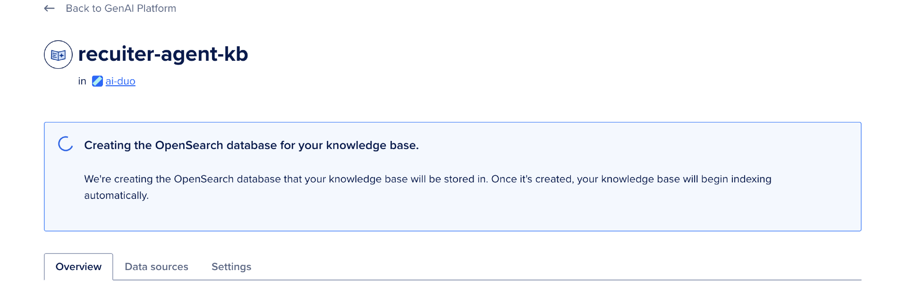

# Step 2: Building a Knowledge Base for the Recruiter AI Agent

In this section, we'll create a Knowledge Base (KB) using DigitalOcean's GenAI Platform, leveraging the dataset stored in your DigitalOcean Spaces object store, named `<your name>-recruiter-agent-dataset`, from the previous step.

## Prerequisites

Ensure you have:

- The dataset uploaded to a Spaces object store (e.g., `<your name>-recruiter-agent-dataset`).
- The endpoint URL and credentials for your Space.

For more details on creating a Knowledge Base, refer to the [Knowledge Base Quickstart Guide](https://docs.digitalocean.com/products/genai-platform/how-to/manage-kb/create/).

## 2.1: Access the GenAI Platform

1. Log in to your DigitalOcean account.
2. Navigate to the GenAI Platform dashboard by selecting **GenAI Platform** from the side menu.

## 2.2: Create a New Knowledge Base

1. Select **GenAI Platform** from the side menu, scroll down until you see `Dive Into GenAI`, then in the **START WITH DATA** box, select `Create a Knowledge base`.

   

2. (Optionally) If you have played around with the GenAI Platform, you may not see the screen above. It may look like this below. In this case, click the **Knowledge base** tab, then select `Create Knowledge base`.

   

2. Enter a name for your Knowledge Base (e.g., `recruiter-agent-kb`).
3. Specify the source as **Spaces Object Store** and select `<your name>-recruiter-agent-dataset` from list of spaces buckets.

   

4. Select the default Embeddings Model: `Multi QA MPNet Base Dot`.
5. Click **Create Knowledge Base** to start the creation process.

## 2.3: Monitor the Process

1. Once created, the Knowledge Base will begin indexing the dataset files. Select your `recruiter-agent-kb` Knowledge base.

   

2. Navigate to the **Knowledge Base Overview** page to monitor progress.

   

3. Verify that all files have been indexed successfully. Any errors will be displayed in the logs.

## Next Steps...

→ [Next Up: Creating Your AI Agent](./STEP3_GENAI_AGENT.md)
