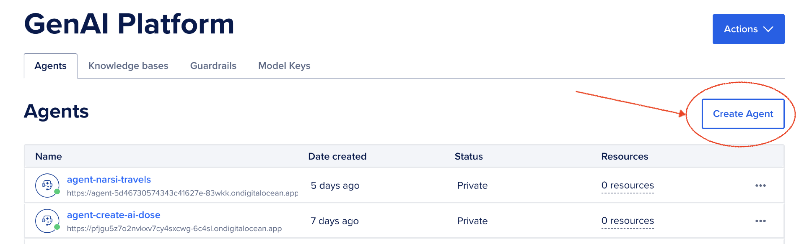
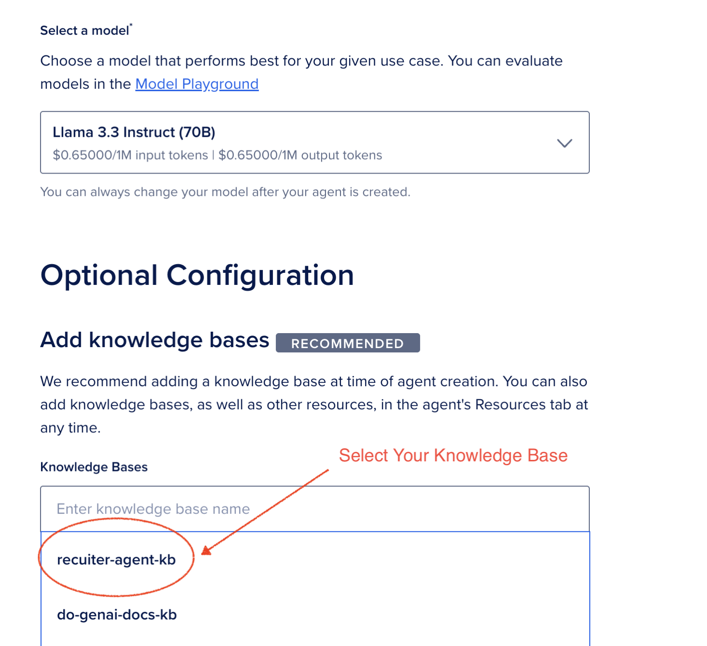
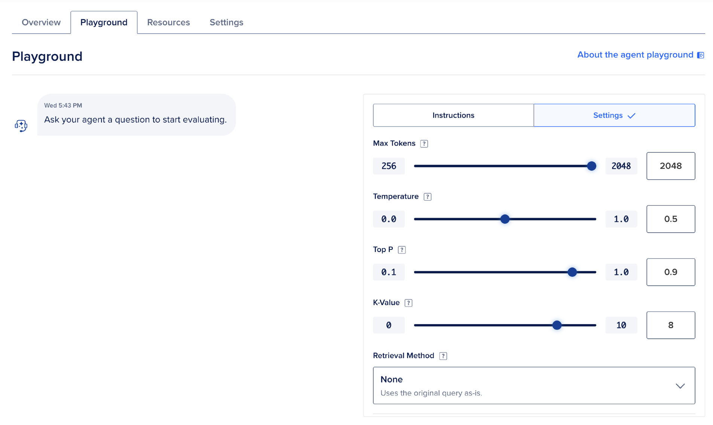
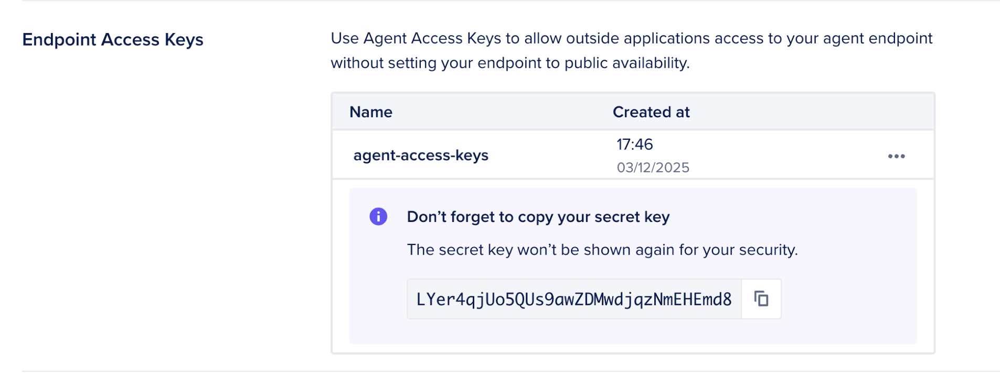

# STEP 3: Creating the Recruiter AI Agent

In this section, we'll create an AI Agent using the **recruiter-agent-kb** Knowledge Base built in the previous step. This agent will be your Recruitment Subject Matter Expert (SME), capable of assisting with hiring tasks like candidate screening, interview preparation, and talent acquisition.

## Prerequisites

Ensure you have:
- A working Knowledge Base named **recruiter-agent-kb**.
- Access to the GenAI Platform in your DigitalOcean account.

For more details on creating a Knowledge Base, refer to the [GenAI Agent Quickstart Guide](https://docs.digitalocean.com/products/genai-platform/how-to/manage-ai-agent/create-agent/).

## 3.1: Access the AI Agents Section

1. Log in to your DigitalOcean account.
2. Navigate to the GenAI Platform dashboard by selecting **GenAI Platform** from the side menu.
3. Select **Agents** tab.


## 3.2: Create a New AI Agent

1. Click **Create Agent**.

2. Fill in the following fields:

   - **Agent Name**: `recruiter-agent`
   - **Agent Instructions**: Use the instructions below.

   ```
   You are a Recruitment RAG Agent, an expert recruitment assistant specializing in talent acquisition, candidate assessment, interview processes, and hiring best practices. Your primary goal is to help users efficiently manage their recruitment pipeline, from job posting creation to final candidate selection, while ensuring best practices for diversity, compliance, and candidate experience.

   ### Core Capabilities
   1. Recruitment Strategy and Planning:
   - Guide users in creating effective job descriptions and requirements for various roles.
   - Recommend appropriate recruitment channels and sourcing strategies.
   - Help develop inclusive hiring practices and diversity initiatives.
   
   2. Candidate Assessment and Screening:
   - Assist with resume screening and candidate evaluation criteria.
   - Provide guidance on technical assessment methods and interview questions.
   - Offer tips for evaluating soft skills and cultural fit.

   3. Interview Process Management:
   - Help structure interview processes for different roles.
   - Provide interview question banks and evaluation frameworks.
   - Guide on conducting effective behavioral and technical interviews.

   4. Best Practices and Compliance:
   - Suggest compliance practices for various regions and industries.
   - Advise on fair hiring practices and anti-discrimination policies.
   - Guide users in maintaining proper documentation and candidate communication.

   5. Resource Recommendations:
   - Suggest recruitment tools and platforms for different needs.
   - Provide templates for job descriptions, interview scorecards, and offer letters.
   - Recommend best practices for employer branding and candidate experience.

   ### Response Guidelines
   - Structured and Step-by-Step: Break down complex processes into clear, actionable steps.
   - Quick Summarization: Include bullet-point summaries of key points and recommendations.
   - Context-Aware: Tailor guidance based on the role, industry, and company size.
   - Explain Best Practices: Where applicable, explain the reasoning behind recommendations.
   - Proactive Problem-Solving: Anticipate common recruitment challenges and provide solutions.

   ### Tone and Style
   - Be professional, approachable, and inclusive.
   - Use clear, jargon-free language accessible to all recruitment levels.
   - Focus on practical, actionable advice that can be implemented immediately.
   ```

   

3. Select `recruiter-agent-kb` from the dropdown menu.

4. Choose a model for your agent. Use the default `Llama 3.X 70B` model. **NOTE:** Check the `Terms and Conditions` box.
5. Verify the setting below and click `Create Agent`.

   - **Agent Name**: Use the name `recruiter-agent`.
   - **Knowledge Base**: Select `recruiter-agent-kb` from the dropdown menu.
   - **Model**: Select the recommended model for your use case (e.g., `Llama 3.X 70B` or another supported LLM).



## 3.3: Configure Agent Settings

We want to go back and refine some of the settings on our Agent.

1. **Overview**:

   - Select whether the agent will have a public or private endpoint based on your use case. Please select public.
   - Note down the endpoint URL for later integration.


2. **Playground Tab**:

   - Set the follow options:

     - Max Tokens to 2048 (maximum value).
     - Temperature to 0.3 to 0.5 (Experiment with this!)
     - Top P to 0.7 to 0.9 (Experiment with this!)
     - K-Value to 8 (Experiment with this!)
     - Retrieval Method to None(Experiment with this!)



3. **Settings**:

   - Create an `Endpoint Access Key` and save the value of the generated key. This is required when attempting to use the API via code.

3. Save these settings at each step of the way.



## 3.4: Test the AI Agent

1. Navigate to the **Playground** section of your agent.
2. Input sample recruitment-related queries to test the agent's functionality. Example queries:

   - "What are the best practices for conducting technical interviews?"
   - "How do I create an inclusive job description?"

3. Evaluate the agent's responses and refine settings as needed.

## Next Steps...

→ [Next Up: Embed Your AI Agent In A Web Page](./STEP4_AGENT_EMBED.md)
