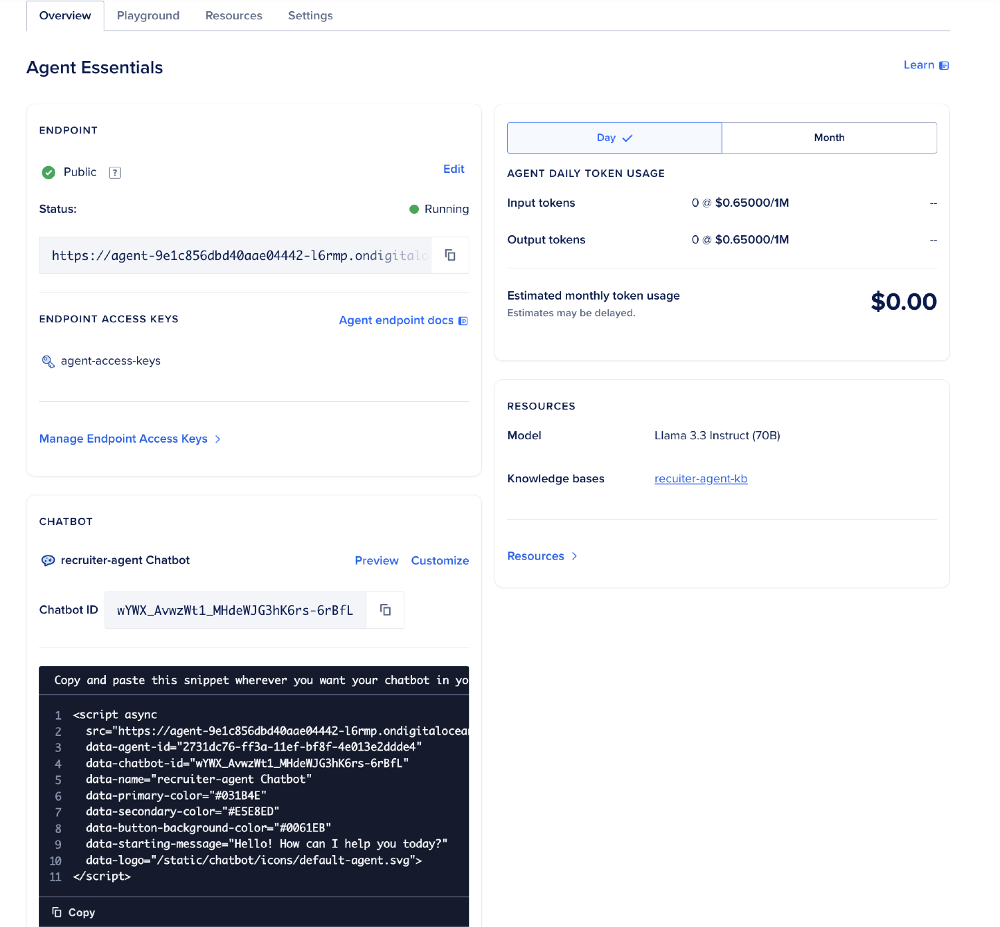

# Step 4: Embed Your AI Agent In A Web Page

Once your Recruiter Assistant is deployed, embedding it into an existing webpage is straightforward. DigitalOcean's GenAI platform provides a pre-generated script that introduces a chat-style interface, allowing seamless interaction with your agent.

## 4.1 Embedding the Chatbot

Follow these steps to embed the chatbot into your webpage:

1. **Locate the Embed Code:**

   - After creating and deploying your AI Agent, navigate to the **GenAI Dashboard** and select your Agent `recruiter-agent`.
   - Look for the **Overview** tab and navigate to the bottom, you will find a pre-generated code to embed on an HTML page.

   

2. **Insert the Embed Code into Your HTML:**

   - Copy the provided script and paste it into your webpage's HTML, typically before the closing `<body>` tag.
   - If you want to use example HTML code, you can find an example in this repo at `recruiter-walkthrough/index.html`. Replace your javascript with the one contained in the HTML.
   - Here's a sample script for reference:

   ```html
    <script async
      src="https://agent-9e1c856dbd40aae04442-l6rmp.ondigitalocean.app/static/chatbot/widget.js"
      data-agent-id="2731dc76-ff3a-11ef-bf8f-4e013e2ddde4"
      data-chatbot-id="wYWX_AvwzWt1_MHdeWJG3hK6rs-6rBfL"
      data-name="recruiter-agent Chatbot"
      data-primary-color="#031B4E"
      data-secondary-color="#E5E8ED"
      data-button-background-color="#0061EB"
      data-starting-message="Hello! How can I help you today?"
      data-logo="/static/chatbot/icons/default-agent.svg">
    </script>
   ```

   - Open a new tab and drag and drop the `index.html` or whatever HTML file you created into the blank tab in Chrome or other browser.

3. **(Optional) Customize the Embed Code**

    - Update the following attributes to tailor the chatbot to your preferences:

        - `data-name`: The display name of your chatbot.
        - `data-primary-color`, `data-secondary-color`, and `data-button-background-color`: Adjust the colors to match your website's branding.
        - `data-starting-message`: Set a custom greeting message for users.
        - `data-logo`: Specify the URL of your custom logo (if any).

4. Save Your Webpage:

    - Save the changes to your HTML file.
    - Ensure the file is hosted on a web server for the chatbot to function correctly.

After embedding the chatbot, open your webpage in a browser to verify the integration. The chatbot should appear as an interactive widget, ready to assist with recruitment-related queries.

## Next Steps...

→ [Next Up: Call Your AI Agent Using An API Call](./STEP5_AGENT_API.md)
