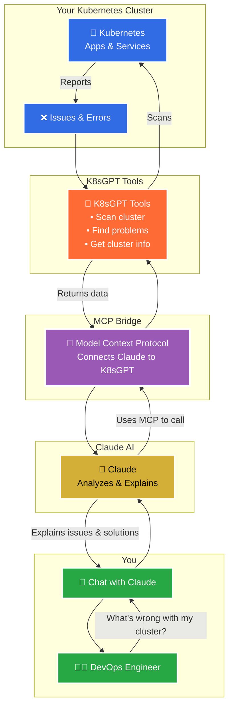

# K8sGPT + Claude MCP Setup Guide



## Quick K8sGPT Installation

Follow the K8sGPT installation guide: https://docs.k8sgpt.ai/getting-started/installation/

## MCP Support 

After K8sGPT installation, first check if it's working by using `k8sgpt analyze`. If it shows results, apply the commands below to start MCP support with Claude.

### Create the configuration directory if it doesn't exist
```bash
mkdir -p ~/Library/Application\ Support/Claude
```

### Create the configuration file
```bash
cat > ~/Library/Application\ Support/Claude/claude_desktop_config.json << EOF
{
  "mcpServers": {
    "k8sgpt": {
      "command": "k8sgpt",
      "args": ["serve", "--mcp", "--port", "3333"],
      "env": {
        "KUBECONFIG": "/Users/\$(whoami)/.kube/config"
      }
    }
  }
}
EOF
```

### Replace \$USER with your actual machine username
```bash
sed -i '' "s/\\\$USER/\$USER/g" ~/Library/Application\ Support/Claude/claude_desktop_config.json
```

### Verify the configuration
```bash
cat ~/Library/Application\ Support/Claude/claude_desktop_config.json
```

## Usage

Once configuration is complete:

1. Restart Claude Desktop
2. Start chatting about your Kubernetes cluster
3. Claude will now have access to K8sGPT analysis capabilities

## Troubleshooting

- Ensure K8sGPT is properly installed and `k8sgpt analyze` works before configuring MCP
- Verify your `KUBECONFIG` path is correct
- Check that port 3333 is available
- Restart Claude Desktop after making configuration changes
