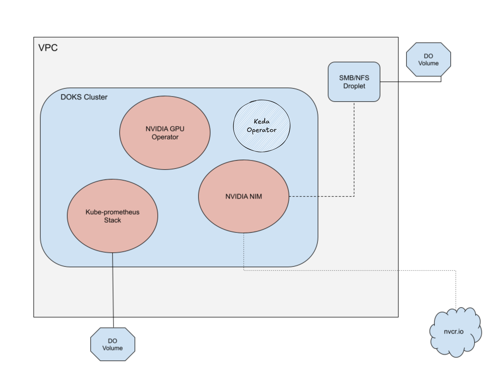

# KEDA

KEDA is a Kubernetes-based Event Driven Autoscaler. With KEDA, you can drive the scaling of any container in Kubernetes based on the number of events needing to be processed.

KEDA is a single-purpose and lightweight component that can be added into any Kubernetes cluster. KEDA works alongside standard Kubernetes components like the Horizontal Pod Autoscaler and can extend functionality without overwriting or duplication. With KEDA you can explicitly map the apps you want to use event-driven scale, with other apps continuing to function. This makes KEDA a flexible and safe option to run alongside any number of any other Kubernetes applications or frameworks.

In this Readme we are showing how you can use Keda to scale our LLM infeference deployments, we are using Keda scaler for Prometheus to get metrics data of num_requests_running and based on that it will do scaling of our deployment



## How to Install?

- Install KEDA

``` bash
helm repo add kedacore https://kedacore.github.io/charts
helm repo update
helm install keda kedacore/keda --namespace keda --create-namespace
```

## Run Service Monitor:

After you install Keda, you need to run service monitor in your cluster which will ensure that Prometheus is able to scrape data from LLM service.

```bash
kubectl apply -f serviceMonitor.yaml
```

Once service monitor is up, run following command to ensure it's in Promethues target and up

```bash
kubectl -n kube-prometheus-stack port-forward svc/kube-prometheus-stack-prometheus 9090:9090
```

Then visit: http://localhost:9090/targets

Look for the target named nim-llm-monitor — it should show UP. This confirms Prometheus is scraping your LLM metrics.

## Provision Keda:

Now create the ScaledObject to instruct KEDA how to scale your LLM service.

```bash
kubectl apply -f scaledObject.yaml
```

To verify the ScaledObject is active:

```bash
kubectl get scaledobjects -n nim
```

## Testing

Use the provided request.go script to send concurrent requests and simulate load:

```bash
go run request.go -url http://localhost:8000/v1/completions -c 200 -d 60
```

This will send 200 concurrent requests for 60 seconds. As the request load increases and the metric crosses the defined threshold (e.g., 0.5), KEDA will trigger pod scaling.

To monitor scaling in real-time:

```bash
kubectl get pods -n nim
```

## Additional Notes

- Make sure the metric query used in your scaledObject.yaml returns a single numeric value.
- Adjust threshold, pollingInterval, and cooldownPeriod to suit your workload characteristics.